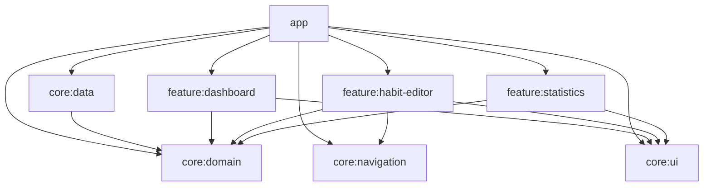

# lockn

[](https://github.com/nevrmd/lockn-app/actions/workflows/ci.yml)
[](LICENSE)
A habit-tracking app for Android, built with Kotlin and Jetpack Compose. Fairly simple, I used it mostly as an excuse to set up a proper multi-module project (MVI, Hilt, Room) with the kind of module boundaries and test coverage you'd expect from a real team.

## Video Preview


## Getting Started

**Requirements:** Android Studio (latest stable), JDK 21, and an Android SDK with `compileSdk 37` installed. Targets `minSdk 29`.

```bash
git clone https://github.com/nevrmd/lockn-app.git
cd lockn-app
./gradlew assembleDebug
```

Or just open it in Android Studio and hit run on a device/emulator running Android 10 (API 29) or later.

**Running the checks locally** (same ones CI runs):

```bash
./gradlew testDebugUnitTest   # unit tests
./gradlew lintDebug           # Android Lint
./gradlew detekt              # static analysis
./gradlew connectedDebugAndroidTest  # instrumented tests (needs a device/emulator)
```

**Building a signed release:** `assembleRelease` gives you an unsigned APK by default. To sign one, copy `keystore.properties.example` to `keystore.properties` at the repo root, point it at a real keystore, and re-run `./gradlew assembleRelease`. Don't commit `keystore.properties` or an actual keystore - both are gitignored.

## Architecture


- **app**: the Hilt entry point and bottom-nav scaffold. The only module allowed to know about every feature, since it's the one wiring navigation together.
- **feature:[x]**: isolated UI features, each with its own ViewModel, MVI-style events, and unit/instrumented tests. Features don't depend on each other or reach into `core:data` directly.
- **core:ui**: the shared design system: theme tokens (color/type/shape/spacing), reusable Loading/Empty/Error states, locale-aware date formatting.
- **core:navigation**: type-safe Nav-Compose routes via Kotlin Serialization.
- **core:domain**: a plain JVM/Kotlin module with no Android dependency: business logic, use cases, entities.
- **core:data**: Room persistence, entity-to-domain mapping, the repository implementation.

## Decisions
- **Reactive state derivation**: Flow operators (`combine`, `flatMapLatest`) merge multiple streams into one immutable `uiState`, backed by `PersistentList`s so Compose can actually skip recomposition instead of just hoping to.
- **Typed error propagation**: write-path use cases return a `DataResult<T>` instead, so a failed increment shows up as a Snackbar rather than crashing the app.
- **Deterministic domain logic**: the weekly/monthly progress math lives in pure Calculators with no framework dependencies, so it's unit-tested without mocking anything.
- **Data integrity**: offline-first via Room, with relational mapping and cascade deletes so orphaned rows can't pile up.

## Quality Assurance
- **CI**: GitHub Actions runs the build, unit tests, Android Lint, and detekt on every push and PR.
- **Static analysis**: detekt with a formatting ruleset. The baseline only carries genuinely deferred items (a handful of long Composables and magic numbers) - not a pile of suppressed noise.
- **Domain**: every use case, validation rule, and the time-series logic (`StatisticsCalculator`) has unit tests.
- **Data**: instrumented tests against a real in-memory Room database - entity/domain mapping, cascade deletes, and a regression test for the schema migration path.
- **Presentation**: ViewModel state-transition tests with Turbine and MockK, plus Compose UI tests for loading/empty/error states and accessibility semantics (content descriptions, progress state descriptions).

## License
[MIT](LICENSE)
