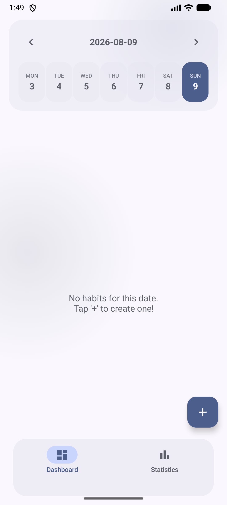
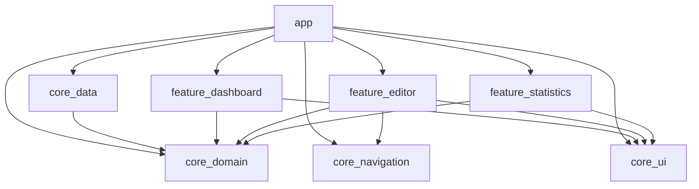

# lockn

[](https://github.com/nevrmd/lockn-app/actions/workflows/ci.yml)
[](LICENSE)

A habit-tracking Android app built with Kotlin and Jetpack Compose, structured as a multi-module Gradle project with MVVM, Hilt, and Room.

### Preview



### Getting Started

**Requirements:** Android Studio (latest stable), JDK 21, Android SDK with `compileSdk 37` installed. The project targets `minSdk 29`.

```bash
git clone https://github.com/nevrmd/lockn-app.git
cd lockn-app
./gradlew assembleDebug
```

Or open the project in Android Studio and run the `app` configuration on a device/emulator running Android 10 (API 29) or later.

**Running checks locally** (the same checks CI runs):

```bash
./gradlew testDebugUnitTest   # unit tests
./gradlew lintDebug           # Android Lint
./gradlew detekt              # static analysis
./gradlew connectedDebugAndroidTest  # instrumented tests (needs a device/emulator)
```

**Building a signed release:** `assembleRelease` produces an unsigned APK by default. To sign it, copy `keystore.properties.example` to `keystore.properties` at the repo root, point it at a real keystore, and re-run `./gradlew assembleRelease`. Never commit `keystore.properties` or a real keystore file — both are gitignored.

### Architecture and Scalability


- **app**: Hilt entry point, bottom-nav scaffold, and the only module that wires all features together via navigation.
- **feature:[x]**: isolated UI features, each with its own ViewModel, MVI-style events, and unit/instrumented tests. Feature modules never depend on each other or on `core:data` directly.
- **core:ui**: shared design system — theme (color/type/shape/spacing tokens), reusable Loading/Empty/Error states, locale-aware date formatting.
- **core:navigation**: type-safe Nav-Compose routes via Kotlin Serialization.
- **core:domain**: pure JVM/Kotlin module (no Android dependency), containing business logic, use cases, and entities.
- **core:data**: persistence via Room, entity↔domain mapping, and the repository implementation.

### Engineering Highlights
*   **Reactive state derivation**: Utilizes Kotlin Flow operators (combine, flatMapLatest) to merge multiple data streams into a single immutable uiState.
*   **Performance Optimization**: Uses Immutable Collections (PersistentList) for UI-exposed lists to enable Compose skippability and prevent unnecessary recompositions.
*   **Type-Safe Navigation**: Implements Compose Navigation 2.8+ with Kotlin Serialization for compile-time safety across features.
*   **Deterministic Logic**: Time-series calculations (Weekly/Monthly progress) are encapsulated in pure-logic Calculators, making the business layer deterministic and unit-testable.
*   **Robust Data Integrity**: Implements an Offline-First strategy using Room with relational mapping and CASCADE deletion logic.
*   **Typed error propagation**: Write-path use cases return a `DataResult<T>` wrapper instead of throwing, so ViewModels handle failure explicitly (e.g. a failed increment surfaces as a Snackbar rather than crashing).
*   **Build System**: centralized dependency management via a Gradle version catalog (TOML).

### Stack
- **Language**: Kotlin
- **UI**: Jetpack Compose (Material 3)
- **DI**: Dagger Hilt
- **Persistence**: Room
- **Concurrency**: Coroutines + Flow

### Quality Assurance
- **CI**: GitHub Actions runs build, unit tests, Android Lint, and detekt on every push/PR.
- **Static analysis**: detekt with a formatting ruleset; the baseline only carries genuinely deferred items (a handful of long Composables and magic numbers), not suppressed noise.
- **Domain**: Unit tests for all use cases, validation rules, and time-series (`StatisticsCalculator`) logic.
- **Data**: Instrumented tests against a real in-memory Room database — entity↔domain mapping, cascade deletes, and a regression test for the schema migration path.
- **Presentation**: ViewModel state-transition tests using Turbine and MockK, plus Compose UI tests covering loading/empty/error rendering and accessibility semantics (content descriptions, progress state descriptions).

### License
[MIT](LICENSE)
